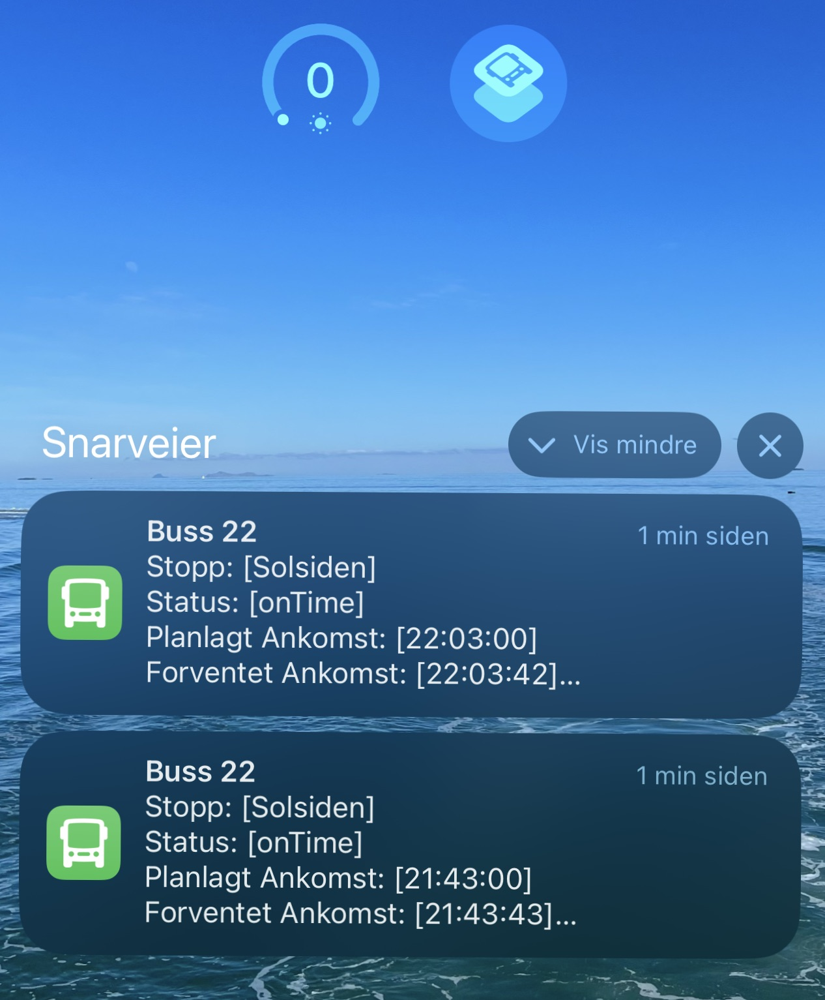
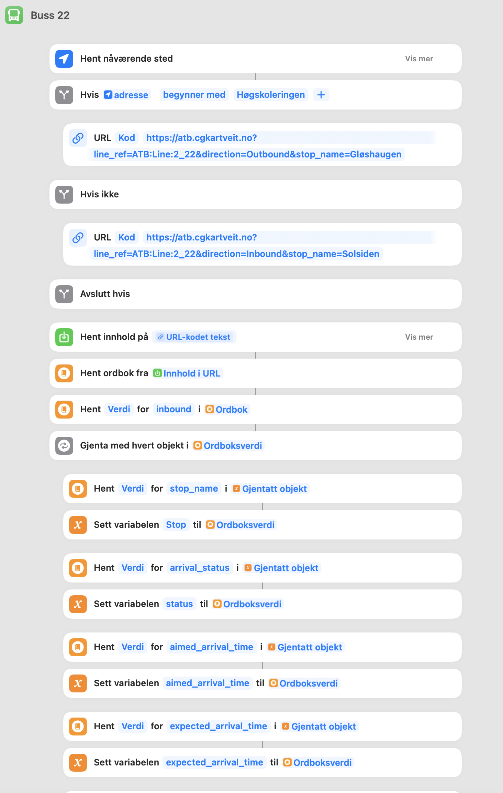
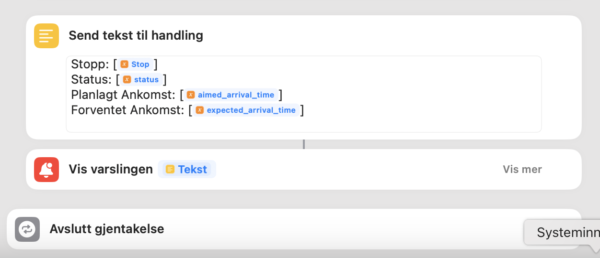

# Bus Real-Time Information API

## Overview

The Bus Real-Time Information API provides real-time data on bus journeys, allowing users to retrieve information based on bus lines, directions, and stop names. This API fetches data from the external Entur API and presents it in a structured and filtered manner.


### Usage with Shortcut
Example usage with Shortcut app on iOS used on homescreen for quick access to bus information.






## Features

- **Real-Time Data**: Get up-to-date information on bus arrivals and statuses.

- **Flexible Filtering**: Retrieve data based on bus line references, directions, and stop names.

- **Easy Integration**: Simple endpoints and query parameters for seamless integration into applications.

## Technologies Used

- **FastAPI**: For building the API endpoints.

- **Requests**: To fetch data from the external Entur API.

- **XML ElementTree**: For parsing the XML data from the Entur API.

- **Datetime**: For handling and formatting date and time information.

## Table of Contents

- [Installation](#installation)

- [Usage](#usage)

- [API Endpoints](#api-endpoints)

  - [Root Endpoint](#root-endpoint)

- [Query Parameters](#query-parameters)

- [Response Format](#response-format)

- [Examples](#examples)

  - [Retrieve All Data](#retrieve-all-data)

  - [Filter by Bus Line](#filter-by-bus-line)

  - [Filter by Direction](#filter-by-direction)

  - [Filter by Stop Name](#filter-by-stop-name)

  - [Combined Filters](#combined-filters)

- [Error Handling](#error-handling)

- [Notes](#notes)

- [Contributing](#contributing)

- [License](#license)

- [Contact](#contact)

## Installation

1\. **Clone the Repository**
``` bash
   git clone https://github.com/KingChristia/ATB-Bus-22-api
   cd ATB-Bus-22-api
```

2\. **Create a Virtual Environment**

   
``` bash
   python -m venv venv
``` 

3\. **Activate the Virtual Environment**

   - On Windows:

     
```bash
     venv\Scripts\activate
```

   - On macOS and Linux:

     
```bash
     source venv/bin/activate     
```

4\. **Install Dependencies**

   
```bash
   pip install -r requirements.txt
```

 

## Usage

1\. **Run the API Server**

   
```bash
   fastapi dev   
```


2\. **Access the API Documentation**

   Open your browser and navigate to:

   
```
   http://127.0.0.1:8000/docs
```

   This will open the interactive API documentation provided by FastAPI.

## API Endpoints

### Root Endpoint

- **URL:** `/`

- **Method:** `GET`

- **Description:** Retrieves bus journey data with optional filters.

- **Query Parameters:** `line_ref`, `direction`, `stop_name`

## Query Parameters

All query parameters are optional but can be used together to refine the data.

- **`line_ref`** (`str`): Filter by bus line reference (e.g., `ATB:Line:2_22`).

- **`direction`** (`str`): Filter by direction. Acceptable values are:

  - `Inbound`

  - `Outbound`

- **`stop_name`** (`str`): Filter by stop name (e.g., `Solsiden`).

## Response Format

The API returns a JSON object with a `data` key containing a list of bus journey details.

**Example:**

```json

{

  "data": [

    {

      "stop_name": "Solsiden",

      "arrival_status": "onTime",

      "aimed_arrival_time": "14:30:00",

      "expected_arrival_time": "14:31:00",

      "expected_arrival_timestamp": "2023-10-10T14:31:00+02:00",

      "vehicle_ref": "ATB:Vehicle:1234",

      "line_ref": "ATB:Line:2_22",

      "direction_ref": "Inbound"

    },

    ...

  ]

}

```

**Fields Explained:**

- **`stop_name`**: The name of the bus stop.

- **`arrival_status`**: The status of the arrival (e.g., `onTime`, `delayed`).

- **`aimed_arrival_time`**: The scheduled arrival time.

- **`expected_arrival_time`**: The updated expected arrival time.

- **`expected_arrival_timestamp`**: The full timestamp of the expected arrival.

- **`vehicle_ref`**: The reference ID of the vehicle. Can be used to Geolocate the Bus

- **`line_ref`**: The bus line reference.

- **`direction_ref`**: The direction of the bus (`Inbound` or `Outbound`).

## Examples

### Retrieve All Data

**Request:**

```

GET http://127.0.0.1:8000/

```

**Description:**

Retrieves all available bus journey data for the current date without any filters.

### Filter by Bus Line

**Request:**

```

GET http://127.0.0.1:8000/?line_ref=ATB:Line:2_22

```

**Description:**

Retrieves data for bus line `ATB:Line:2_22`.

### Filter by Direction

**Request:**

```

GET http://127.0.0.1:8000/?direction=Inbound

```

**Description:**

Retrieves data for buses heading `Inbound`.

### Filter by Stop Name

**Request:**

```

GET http://127.0.0.1:8000/?stop_name=Solsiden

```

**Description:**

Retrieves data for buses stopping at `Solsiden`.

### Combined Filters

**Request:**

```

GET http://127.0.0.1:8000/?line_ref=ATB:Line:2_22&direction=Inbound&stop_name=Solsiden

```

**Description:**

Retrieves data for bus line `ATB:Line:2_22`, heading `Inbound`, and stopping at `Solsiden`.


## Notes

- **Date Filtering:**

  The API only retrieves data for the current date.

- **Time Zones:**

  Times are provided in the time zone returned by the Entur API (typically local time).

- **Case Sensitivity:**

  - **`stop_name`**: The `stop_name` parameter is case-sensitive. Ensure you use the exact casing as in the data.

  - **Possible Enhancement**: Modify the code to perform case-insensitive matching if needed.

## Contact

For questions or feedback, please contact:

- **Name**: Christian Kartveit

- **Email**: [Christian@cgkartveit.no](mailto:christian@cgkartveit.no)

- **GitHub**: [KingChristia](https://github.com/KingChristia)

---

**Enjoy using the Bus Real-Time Information API!**